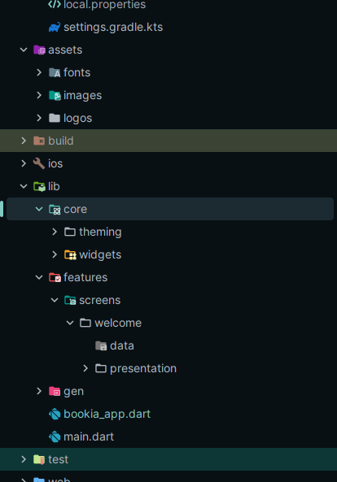

<h1>📚 Bookia App</h1>

<strong>Bookia</strong> is a Flutter application that aims to deliver a clean, modern, and smooth user experience 
for exploring and managing books. The project follows a <strong>feature-based architecture</strong> to keep the code organized and scalable.

<h2>🎨 System Design</h2>

Below is a preview of the system architecture and interface layout:

  

<h2>🖼️ Welcome Screen</h2>

The Welcome Screen introduces users to Bookia with a modern and minimal design.

  

Made with 💙 using Flutter

